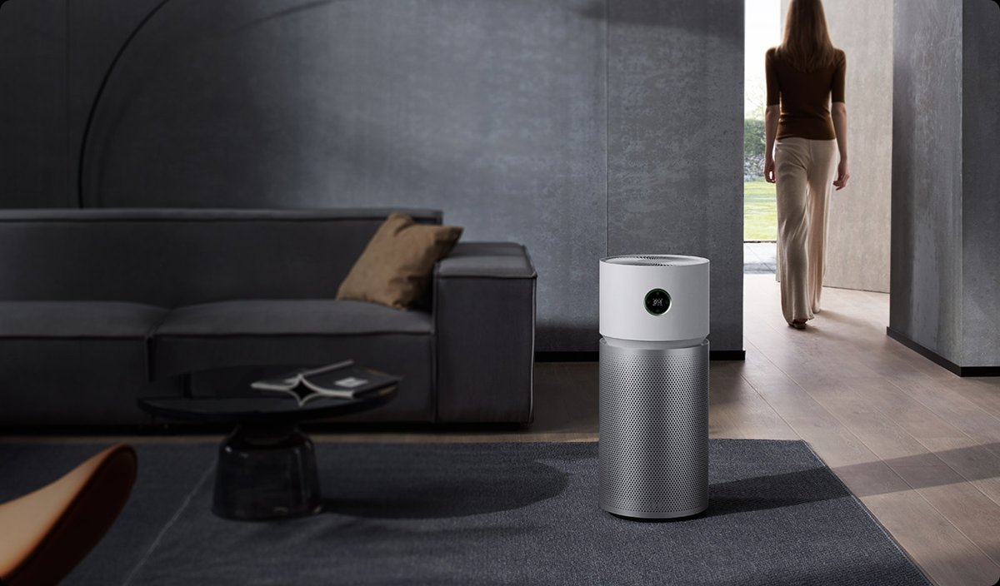
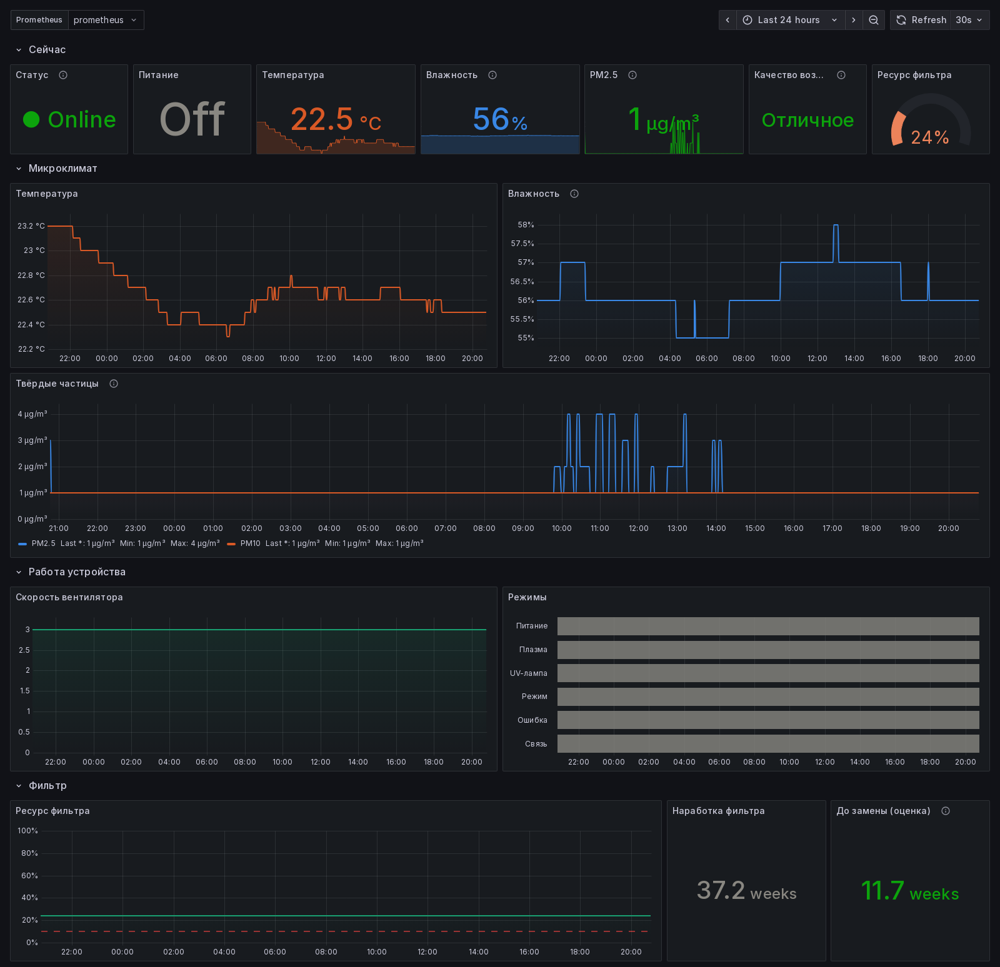

# Xiaomi Air Purifier Exporter

[](https://github.com/h5vx/xiaomi-air-purifier-exporter/actions/workflows/docker.yml)
[](https://hub.docker.com/r/h5vx/xiaomi-air-purifier-exporter)
[](https://hub.docker.com/r/h5vx/xiaomi-air-purifier-exporter)
[](LICENSE)

A [Prometheus](https://prometheus.io/) exporter for the **Xiaomi Smart Air Purifier Elite**
(`zhimi.airp.meb1`). It talks to the device directly over the local miIO protocol, so it needs
no Xiaomi cloud, no Home Assistant and no `python-miio`, only `cryptography` and `prometheus-client`.

<p align="center">
  
</p>

## Features

- Exports temperature, humidity, PM2.5, PM10, air quality, fan level, mode, plasma/UV state,
  filter life and more (see [Metrics](#metrics))
- Locates the device by **MAC address**, so DHCP lease changes don't break anything
- Recovers on its own after device reboots and network glitches
- Tiny Docker image for `amd64` and `arm64` (Raspberry Pi included)
- Ships with a ready-made [Grafana dashboard](contrib/grafana/dashboard.json)



## Quick start

### 1. Get the device token

miIO traffic is encrypted with a per-device 32-character token. The easiest way to get it is
[Xiaomi-cloud-tokens-extractor](https://github.com/PiotrMachowski/Xiaomi-cloud-tokens-extractor):

```sh
# Linux
bash <(curl -L https://github.com/PiotrMachowski/Xiaomi-cloud-tokens-extractor/raw/master/run.sh)

# or, if that fails, the Docker version
bash <(curl -L https://github.com/PiotrMachowski/Xiaomi-cloud-tokens-extractor/raw/master/run_docker.sh)
```

On Windows, download
[token_extractor.exe](https://github.com/PiotrMachowski/Xiaomi-cloud-tokens-extractor/releases/latest/download/token_extractor.exe).

Log in with your Mi Home account. The extractor prints every device with its **TOKEN**, **IP**
and **MAC**. Write down the ones for your purifier (model `zhimi.airp.meb1`).

### 2. Run the exporter

```sh
cp .env.example .env   # put XIAOMI_TOKEN and XIAOMI_MAC in here
docker compose up -d
```

or without compose:

```sh
docker run -d --name xiaomi-air-purifier-exporter \
  --network host --restart unless-stopped \
  -e XIAOMI_TOKEN=0123456789abcdef0123456789abcdef \
  -e XIAOMI_MAC=aa:bb:cc:dd:ee:ff \
  h5vx/xiaomi-air-purifier-exporter
```

> [!NOTE]
> `--network host` is required: the exporter reads the host's ARP table to map the MAC address
> to an IP, and it needs direct UDP access to the device on your LAN.

Check it: `curl -s localhost:9811/metrics | grep xiaomi_`

### 3. Scrape it with Prometheus

```yaml
scrape_configs:
  - job_name: xiaomi-air-purifier
    scrape_interval: 30s
    static_configs:
      - targets: ["<exporter-host>:9811"]
```

### 4. Import the Grafana dashboard

In Grafana go to **Dashboards → New → Import**, upload
[`contrib/grafana/dashboard.json`](contrib/grafana/dashboard.json) and pick your Prometheus
data source.

## Configuration

| Variable       | Required | Default | Description                                   |
|----------------|:--------:|---------|-----------------------------------------------|
| `XIAOMI_TOKEN` | yes      |         | Device token, 32 hex characters               |
| `XIAOMI_MAC`   | yes      |         | Device MAC address, e.g. `aa:bb:cc:dd:ee:ff`  |
| `LISTEN_PORT`  | no       | `9811`  | Port the `/metrics` HTTP endpoint listens on  |

The device IP is looked up in `/proc/net/arp`. If it isn't there, the exporter pings every host
in the directly attached subnets (`/22` or smaller) to fill the ARP cache. On larger networks,
reserve a DHCP lease or add a static ARP entry.

## Metrics

All metrics are gauges, refreshed from the device on every scrape.

| Metric                                                  | Description                         |
|---------------------------------------------------------|-------------------------------------|
| `xiaomi_purifier_up`                                    | `1` if the last poll succeeded      |
| `xiaomi_purifier_air_purifier_on`                       | Power state (`1` = on)              |
| `xiaomi_purifier_air_purifier_fault`                    | Fault code (`0` = no faults)        |
| `xiaomi_purifier_air_purifier_mode`                     | Mode enum (MIoT spec)               |
| `xiaomi_purifier_air_purifier_fan_level`                | Fan level                           |
| `xiaomi_purifier_air_purifier_plasma`                   | Plasma ionizer state (`1` = on)     |
| `xiaomi_purifier_air_purifier_uv`                       | UV lamp state (`1` = on)            |
| `xiaomi_purifier_environment_relative_humidity_percent` | Relative humidity, %                |
| `xiaomi_purifier_environment_pm25_density_ugm3`         | PM2.5 density, µg/m³                |
| `xiaomi_purifier_environment_pm10_density_ugm3`         | PM10 density, µg/m³                 |
| `xiaomi_purifier_environment_temperature_celsius`       | Temperature, °C                     |
| `xiaomi_purifier_environment_air_quality`               | Air quality enum (`0` = excellent)  |
| `xiaomi_purifier_filter_life_level_percent`             | Filter life remaining, %            |
| `xiaomi_purifier_filter_used_time_hours`                | Filter used time, hours             |

## Running without Docker

Python 3.10+ is required.

```sh
pip install git+https://github.com/h5vx/xiaomi-air-purifier-exporter
XIAOMI_TOKEN=... XIAOMI_MAC=... xiaomi-air-purifier-exporter
```

## Helper scripts

The [`scripts/`](scripts) directory has a few tools for poking at miIO devices:

- `discover.py [broadcast-or-ip]`: finds miIO devices on the LAN with the "hello" broadcast
- `read_sensors.py <ip> <token>`: dumps every readable MIoT property of a device, using its
  spec from [miot-spec.org](https://miot-spec.org/). Needs `python-miio`
  (`pip install ".[tools]"`). Handy for adding support for other models.

## Development

```sh
uv run --group dev pytest
docker build -t xiaomi-air-purifier-exporter .
```

To publish a release, push a tag such as `v0.1.0`. GitHub Actions then builds and pushes the
multi-arch image to Docker Hub. The repository needs the `DOCKERHUB_USERNAME` and
`DOCKERHUB_TOKEN` secrets.

## License

[MIT](LICENSE). The product photo is © Xiaomi and is used for illustration only.
This project is not affiliated with Xiaomi.
